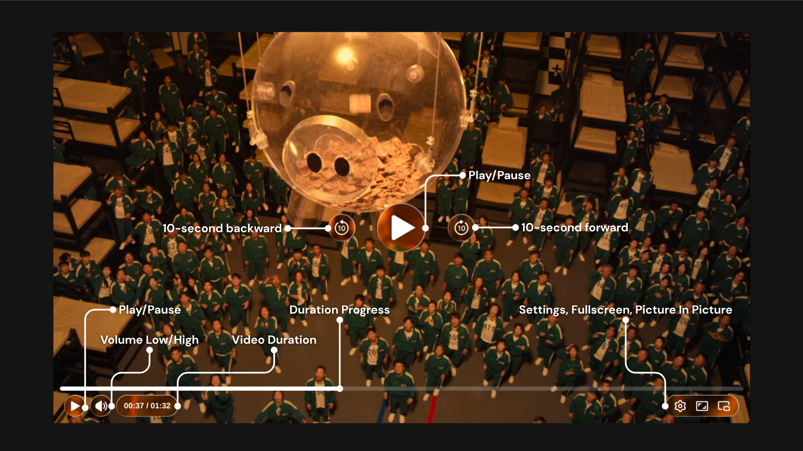
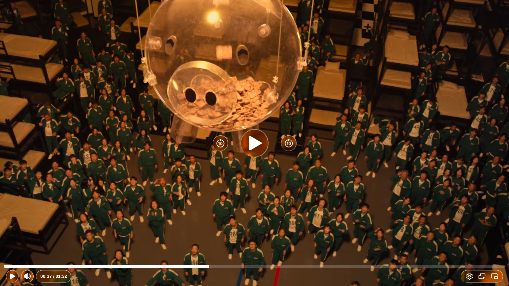
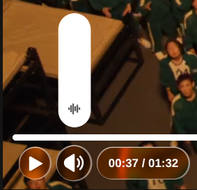
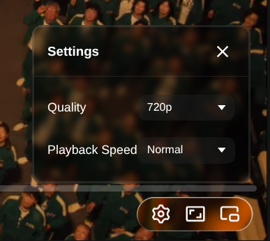

# 🌊 Liquid Glass UI Video Player

[](https://github.com/b4-behroz/Liquid-Glass-UI-Video-Player/stargazers)
[](https://github.com/b4-behroz/Liquid-Glass-UI-Video-Player/network/members)
[](LICENSE)

An ultra-premium, cinematic HTML5 video player meticulously engineered with pure HTML, CSS, and modern JavaScript. Moving far beyond rigid traditional layouts, this player introduces an organic **Liquid Glass Architecture**—utilizing advanced SVG fractal noise displacement and custom physics-based lighting states to deliver an immersive glassmorphic interface.

---

## 📸 Interface Showcases

### 🔮 Main Interface & Fluid Overlay


### 🔊 Vertical Capsule Volume Hub


### ⚙️ Premium Settings Control Panel


### 🖥️ Immersive Cinematic Fullscreen Mode


---

## 🕹️ Deep-Dive Feature Set

### 1. 🎛️ Organic Core Playback Controls
*   **Spacebar & Click Bindings:** Standard desktop keyboard shortcuts map `Spacebar` globally to effortlessly toggle Play and Pause modes alongside interactive canvas clicking.
*   **Micro-Animated Center Nodes:** Centralized liquid glass wrapper controls feature fluidly dynamic states for instant feedback when running, pausing, or looping.
*   **⌛ Dual-State Control Architecture:** Play (`#play-icon` / `#center-play-icon`) and Pause (`#pause-icon` / `#center-pause-icon`) icons dynamically hide and display across both the main canvas overlay and the bottom status bar seamlessly.

### 2. ⏳ Timeline Navigation & Advanced Seeker
*   **🔄 Integrated Fast-Forward & Rewind:** Dedicated multi-state wrappers handle precision time skipping (`10s` directional jumps) for rapid scrub-free navigation.
*   **🔄 Instant Refresh Engine:** An integrated micro-button interaction wrapper forces clean media stream refreshes without breaking page states or resetting structural layout DOM properties.
*   **🎨 Canvas-Driven Hover Previews:** Built with structural hooks (`#thumbnail-canvas`) allowing active timeline mouse coordinates to pull immediate real-time video frames from secondary muted reference engines (`#p-vid`).

### 3. 🔊 Sound Engineering Hub
*   **🎚️ Vertical Capsule Volume Sliders:** Features an isolated `.vol-sld` modular tray displaying reactive volumetric nodes upon mouse interaction.
*   **🔊 Triple-State Speaker Dynamics:** Dynamically transitions audio output UI feedback across standard High Volume (`#volume-high`), Lower Volume (`#volume-low`), and completely Muted (`#volume-mute`) vector paths dynamically.

### 4. ⚙️ Flyout Custom Configuration Module
*   **🎚️ Live Quality Selectors:** Custom UI dropdown triggers (`data-type="quality"`) allow programmatic transitions between **Auto**, **1080p**, **720p**, **480p**, and **360p** streams gracefully.
*   **⚡ Playback Speed Modifiers:** Fine-tune pacing dynamically (`data-type="speed"`) through sleek speed configurations spanning **0.5×**, **Normal**, **1.5×**, and **2×** speed rates[cite: 1].

### 5. 🖥️ Immersive View Modes
*   **📱 Picture-in-Picture (PiP):** Supports modern system layers (`.pip-btn`) to break video instances out into floating browser windows overlaying work panels seamlessly[cite: 1].
*   **📺 Native Screen Maximizer:** Built-in hooks monitor browser state updates, instantly updating the underlying full-bleed layout vector graphics (`.fs-icon` to `.exit-fs-icon`) for zero immersion breakages[cite: 1].

---

## ⚙️ Project File Architecture

The engine uses standard native styling configurations to keep payload weights down to an absolute minimum:

```bash
Liquid-Glass-UI-Video-Player/
├── index.html       # HTML layout with specialized SVG glass distortion matrices
├── style.css        # Glassmorphic lighting, backdrop blurs, and surface reflections
└── script.js        # Event delegation, video runtime math, and custom dropdown logic
