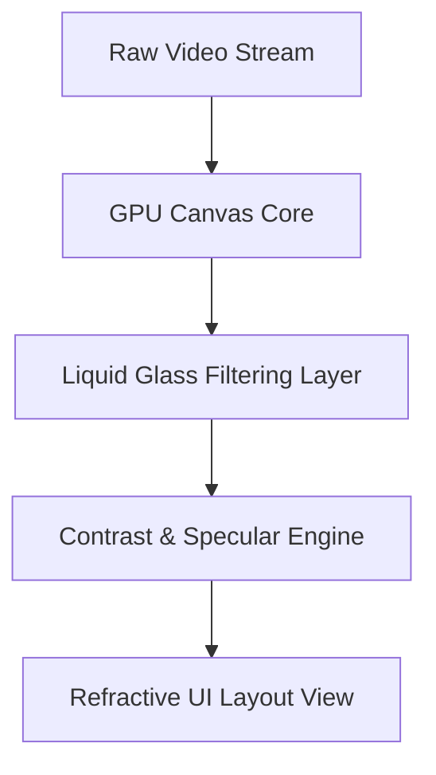

# 💧 Liquid Glass UI Video Player

[](LICENSE)
[](CONTRIBUTING.md)
[](https://developer.apple.com/documentation/TechnologyOverviews/adopting-liquid-glass)

A highly immersive, next-generation video player featuring a **Liquid Glass UI** layout. Built around real-time light refraction, adaptive tinting, and fluid canvas animations, this player treats user interface elements as dynamic lenses that morph organically over your media content.

[✨ Live Demo](https://your-demo-link.com) · [🐞 Report Bug](https://github.com) · [💡 Request Feature](https://github.com)

---

> [!IMPORTANT]
> This player leverages modern GPU hardware acceleration for real-time backdrop lensing and dynamic specular highlights. Ensure your environment supports web-gl/native rendering context for optimal 60fps glass physics.

---

## 🚀 Key Features

* **Lensing & Light Refraction:** Interface controls dynamically warp, bend, and focus background video colors instead of using flat blurs.
* **Contextual Morphing:** UI control panels and menu bubbles expand, contract, and shape-shift seamlessly based on touch gestures and hover actions.
* **Adaptive Contrast Tinting:** Intelligently switches opacity and subtle gradients between light and dark backgrounds to ensure text remains readable.
* **Hardware-Accelerated Physics:** Fluid animations utilize native rendering pipelines to move floating chrome elements smoothly.
* **Custom Aspect Ratios:** Handles cinematic ultrawide, vertical mobile layouts, and standard 16:9 media with edge-to-edge concentric fitting.

---

## 🛠️ Architecture & Workflow

The interface layer functions as a unified floating plane over the media playback engine, utilizing real-time compositing filters.



---

## 📦 Installation

Get up and running locally by setting up the codebase framework:

```bash
# Clone the repository
git clone https://github.com

# Navigate into the project folder
cd liquid-glass-video-player

# Install required dependencies
npm install

# Start the local development canvas environment
npm run dev
```

---

## 💻 Quick Usage Example

Embed the Liquid Glass Video Player into your web application or view layout using this simple syntax pattern:

```html
<div class="liquid-player-container">
  <video-player 
    src="path/to/cinematic_video.mp4" 
    ui-theme="liquid-glass"
    refraction-intensity="0.8"
    adaptive-tint="true">
  </video-player>
</div>
```

---

## ⚙️ Configuration Properties

| Property | Type | Default | Description |
| :--- | :--- | :--- | :--- |
| `src` | `String` | `null` | URL or relative path to your video resource file. |
| `ui-theme` | `String` | `"liquid-glass"` | Interface skin selection (`liquid-glass`, `frosted`, or `solid`). |
| `refraction-intensity` | `Float` | `0.5` | Dictates how intensely background video colors warp through the UI elements (`0.0` - `1.0`). |
| `adaptive-tint` | `Boolean` | `true` | Enables automatic adjustment of dark/light element shadows to preserve visual contrast. |

---

## 🎮 Keyboard Controls

Quick shortcuts built natively into the active player display framework:

* `Spacebar` — Play / Pause media playback.
* `M` — Mute / Unmute audio stream output.
* `F` — Toggle full-screen layout display view.
* `Arrow Left / Right` — Seek backward or forward by 5 seconds.

---

## 🤝 Contributing

Contributions make the open-source community an amazing place to learn, inspire, and create. Any contributions you make are **greatly appreciated**.

1. Fork the Project Repository.
2. Create your Feature Branch (`git checkout -b feature/AmazingFeature`).
3. Commit your Changes (`git commit -m 'Add some AmazingFeature'`).
4. Push to the Branch (`git push origin feature/AmazingFeature`).
5. Open a Pull Request for review.

---

## 📄 License

Distributed under the MIT License. See the [LICENSE](LICENSE) file for more details.
